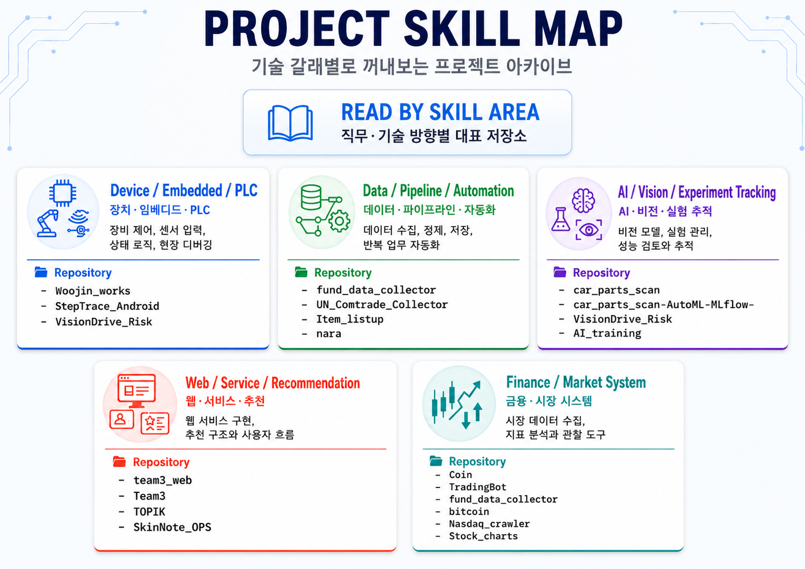

# 이동환 | Donghwan Lee

이 GitHub는 완성작만 전시한 포트폴리오가 아니라,
제가 문제를 발견하고, 직접 구현해보고, 실제 사용 여부와 한계를 판단한 기록입니다.

프로젝트를 단순히 **완성 / 미완성**으로 나누지 않습니다.
대신 아래 기준으로 분류합니다.

* 실제로 사용 중인 프로젝트
* 완성했지만 현재는 사용을 보류한 프로젝트
* 구현 또는 검토 중 한계를 확인하고 중단한 프로젝트
* 학습과 구조 이해를 위해 만든 프로젝트
* 활동과 실무 기록을 남기기 위한 저장소

---

## Project Archive Map

  

---

## Repository Status Map

| 분류             | 의미                                                             |
| -------------- | -------------------------------------------------------------- |
| **실제 사용 중**    | 개인 업무, 데이터 분석, 시장 관찰, 실무 정리에 실제로 사용하거나 계속 개선 중인 프로젝트           |
| **완성 후 사용 보류** | 핵심 기능은 구현했지만, 운영 비용, 데이터 확보, 시장성, 우선순위 등의 이유로 현재는 사용하지 않는 프로젝트 |
| **한계 확인 후 중단** | 기술 가능성은 검토했지만, 성능, 비용, 유지보수성, 실사용 효율의 한계를 확인하고 중단한 프로젝트        |
| **학습 / 구조 실험** | 특정 기술, API, 프레임워크, 센서, 통신, DB 연동 구조를 이해하기 위해 만든 프로젝트           |
| **활동 / 실무 기록** | 코드보다 경험, 문서, 현장 대응, 교육 과정, 산출물 기록이 중요한 저장소                     |

---

## Quick Repository Index

| 분류             | Repositories                                                                                                                                                                                                                                                                                                                                                                                                                                                                                                                                                     |
| -------------- | ---------------------------------------------------------------------------------------------------------------------------------------------------------------------------------------------------------------------------------------------------------------------------------------------------------------------------------------------------------------------------------------------------------------------------------------------------------------------------------------------------------------------------------------------------------------- |
| **실제 사용 중**    | [Woojin_works](https://github.com/whan1569/Woojin_works), [Coin](https://github.com/whan1569/Coin), [fund_data_collector](https://github.com/whan1569/fund_data_collector), [TradingBot](https://github.com/whan1569/TradingBot), [UN_Comtrade_Collector](https://github.com/whan1569/UN_Comtrade_Collector)                                                                                                                                                                                                                                                     |
| **완성 후 사용 보류** | [TOPIK](https://github.com/whan1569/TOPIK), [team3_web](https://github.com/whan1569/team3_web), [Team3](https://github.com/whan1569/Team3), [StepTrace_Android](https://github.com/whan1569/StepTrace_Android)                                                                                                                                                                                                                                                                                                                                                   |
| **한계 확인 후 중단** | [VisionDrive_Risk](https://github.com/whan1569/VisionDrive_Risk), [AutoBid_Bot](https://github.com/whan1569/AutoBid_Bot), [insurance_blockchain](https://github.com/whan1569/insurance_blockchain), [National_Fiscal_Evaluation](https://github.com/whan1569/National_Fiscal_Evaluation), [FairWay](https://github.com/whan1569/FairWay), [car_parts_scan](https://github.com/whan1569/car_parts_scan), [car_parts_scan-AutoML-MLflow-](https://github.com/whan1569/car_parts_scan-AutoML-MLflow-)                                                               |
| **학습 / 구조 실험** | [ChatApp](https://github.com/whan1569/ChatApp), [C--MySql-connect](https://github.com/whan1569/C--MySql-connect), [aws_study](https://github.com/whan1569/aws_study), [AI_training](https://github.com/whan1569/AI_training), [Item_listup](https://github.com/whan1569/Item_listup), [Nasdaq_crawler](https://github.com/whan1569/Nasdaq_crawler), [Stock_charts](https://github.com/whan1569/Stock_charts), [bitcoin](https://github.com/whan1569/bitcoin), [SkinNote_OPS](https://github.com/whan1569/SkinNote_OPS), [nara](https://github.com/whan1569/nara) |
| **활동 / 실무 기록** | [Woojin_works](https://github.com/whan1569/Woojin_works), [college_career](https://github.com/whan1569/college_career), [whan1569](https://github.com/whan1569/whan1569)                                                                                                                                                                                                                                                                                                                                                                                                                                                   |

---

<strong>1. 실제 사용 중</strong>

 

현재 개인 업무, 데이터 분석, 시장 관찰, 실무 정리 등에 직접 사용하거나 계속 개선 중인 프로젝트입니다.

---

## [Woojin_works](https://github.com/whan1569/Woojin_works)

산업 장비 제어 과정에서 발생한 PLC/C 기반 제어 로직, I/O 매핑, 상태 전이, 출력 제어, 통신 인터페이스, 현장 디버깅, 버전 관리 이슈를 기록한 실무 저장소입니다.

**핵심 성격**

* B&R PLC / Automation Studio 기반 장비 제어 기록
* C 기반 사출기 제어 로직 분석 및 수정
* I/O 매핑, 출력 조건, 상태 전이 로직 정리
* MHC Interface / InterfaceCyclic 관련 로직 분석
* SVN 유지보수, 신규 분기 관리, 라이브러리 범위 정리
* 현장 테스트 및 수정 보고서성 문서 정리

**상태**
실무 사용 / 현장 대응 기록 / 계속 누적 중

---

## [Coin](https://github.com/whan1569/Coin)

바이낸스 선물 시장의 롱숏 비율, 포지션 비율, 미결제약정, 펀딩비 등을 수집하고 시각화하기 위한 개인 시장 분석 도구입니다.

**핵심 성격**

* Binance API 기반 시장 데이터 수집
* Long/Short Ratio, Top Account Ratio, Top Position Ratio 분석
* Open Interest, Funding Rate 기반 과열 구간 관찰
* Streamlit 기반 실시간/히스토리 뷰어 구성
* 개인 매매 판단 보조용 데이터 구조 실험

**상태**
실제 사용 중 / 시장 관찰 도구 / 계속 개선 중

---

## [fund_data_collector](https://github.com/whan1569/fund_data_collector)

주식, 원자재, 채권, 외환, 암호화폐, 부동산 등 여러 자산군 데이터를 수집하고 저장하기 위한 개인 데이터 파이프라인입니다.

**핵심 성격**

* 자산군별 fetch 모듈 분리
* Parquet 기반 데이터 저장
* 수집 상태 추적
* 로그 및 리포트 구조
* 재시작 가능한 데이터 수집 흐름
* 여러 금융/거시 데이터 소스를 하나의 수집 구조로 통합

**상태**
개인 데이터 인프라 / 수집 구조화 / 사용 및 개선 가능

---

## [TradingBot](https://github.com/whan1569/TradingBot)

거래 전략, 실행, 거래소 인터페이스, 리스크 관리, 테스트/실거래 모드를 분리한 트레이딩 시스템 구조 실험입니다.

**핵심 성격**

* exchange / execution / strategy / config / model / dashboard / test 모듈 분리
* Binance API 기반 워크플로우 구성
* 전략과 실행 계층 분리
* 리스크 관리 구조 검토
* 테스트 모드와 실거래 모드 분리
* 자동매매 시스템의 구조적 안정성 검토

**상태**
개인 시스템 실험 / 일부 사용 가능 / 실거래 중심보다는 구조 검증 중심

---

## [UN_Comtrade_Collector](https://github.com/whan1569/UN_Comtrade_Collector)

UN Comtrade API를 활용해 국가, HS Code, 운송 방식 기준의 수출입 데이터를 수집하고 분석하기 위한 프로젝트입니다.

**핵심 성격**

* 국가 기준 무역 데이터 수집
* HS Code 기준 수출입 데이터 수집
* 운송 방식별 데이터 수집
* 수집 완료 기간 스킵 구조
* CSV 캐싱
* API 제한 대응 구조
* 무역 금액, 수량, 단가, 항공/해상 비율 분석
* Streamlit 기반 대시보드 구성

**사용 목적**
해외 유통 아이템 검토, 국가별 수출입 흐름 확인, HS Code 기반 시장 규모 파악, 운송 방식별 단가와 물량 비교를 위해 실제로 사용하고 있습니다.
단순 수집기가 아니라, 아이템 검토 과정에서 데이터 기반 1차 필터링 도구로 활용합니다.

**상태**
실제 사용 중 / 무역 데이터 수집·분석 도구

---

<strong>2. 완성 후 사용 보류</strong>

 

핵심 기능은 구현했지만, 현재는 운영하지 않거나 우선순위에서 내려둔 프로젝트입니다.
보류 이유는 단순 실패가 아니라 운영 비용, 데이터 확보, 시장성, 관리 부담, 우선순위 판단에 가깝습니다.

---

## [TOPIK](https://github.com/whan1569/TOPIK)

TOPIK 시험의 문제 번호별 고정 출제 유형을 활용해, 초기 사용자 데이터가 부족한 상황에서도 동작 가능한 규칙 기반 학습 추천 구조를 실험한 프로젝트입니다.

**핵심 성격**

* 모의시험 응시 기능
* 정답/오답 판별
* 문제 번호 기반 유형 분류
* 사용자별 오답 기록 저장
* 취약 유형 분석
* 동일/유사 유형 문제 재노출 흐름 설계
* Cold Start 상황에서 규칙 기반 추천 가능성 검토

**보류 이유**
핵심 추천 구조는 구현했지만, 실제 서비스화를 위해서는 문제 데이터 확보, UI 개선, 사용자 관리, 보안, 운영 비용이 추가로 필요하다고 판단했습니다.

**상태**
교육 서비스 프로토타입 / 완성 후 운영 보류

---

## [team3_web / VODiscovery](https://github.com/whan1569/team3_web)

LG헬로비전 DX DATA 교육 과정에서 실제 VOD 데이터를 활용해 맞춤형 추천 플랫폼을 구현한 팀 프로젝트입니다.

**핵심 성격**

* React/Vite 기반 프론트엔드
* Node.js/Express/MySQL 기반 백엔드
* JWT 인증 구조
* 사용자 시청 이력 기반 장르 통계
* 시청 패턴 분석 API
* 콘텐츠 임베딩과 VectorDB 기반 추천 전략
* AWS 배포 및 시연

**보류 이유**
교육 과정 산출물로 시연까지 완료했지만, 실제 운영 서비스가 목적은 아니었기 때문에 현재는 산출물 형태로 보관하고 있습니다.

**상태**
교육 과정 산출물 / 시연 완료 / 운영 보류

---

## [Team3](https://github.com/whan1569/Team3)

VOD 추천 프로젝트의 기획, 데이터 분석, 추천 전략, VectorDB 전략 등을 정리한 산출물 저장소입니다.

**핵심 성격**

* VOD 추천 프로젝트 기획 자료
* 데이터 분석 기록
* 줄거리 기반 추천 전략
* VectorDB 기반 Cold Start 완화 전략
* 팀 프로젝트 산출물 정리

**상태**
교육 과정 문서 / 프로젝트 산출물

---

## [StepTrace_Android](https://github.com/whan1569/StepTrace_Android)

Android 디바이스의 센서 데이터를 수집하고 기록하는 구조를 실험하기 위한 만보기/위치 기록 앱입니다.

**핵심 성격**

* Android Step Counter 센서 활용
* SensorManager / SensorEventListener 기반 센서 이벤트 처리
* Activity 생명주기에 따른 센서 리스너 등록/해제
* 일정 걸음 수마다 GPS 위치 정보 기록
* JSON 형태 데이터 저장 구조
* 권한, null 처리, 백그라운드 동작 등 디바이스 앱 고려 요소 정리

**보류 이유**
센서 처리와 위치 기록 구조는 구현했지만, 단독 서비스로 확장할 목적은 없었기 때문에 Android 센서 구조 학습 및 증빙 프로젝트로 보관하고 있습니다.

**상태**
소형 완성형 Android 앱 / 사용 보류

---

<strong>3. 한계 확인 후 중단</strong>

 

기술적으로 가능성은 검토했지만, 성능, 비용, 유지보수성, 데이터 확보, 실사용 효율의 한계를 확인하고 중단한 프로젝트입니다.

---

## [VisionDrive_Risk](https://github.com/whan1569/VisionDrive_Risk)

모바일 카메라와 Optical Flow 기반 움직임 분석을 활용해 사고 전조 판단이 가능한지 검토한 프로젝트입니다.

**핵심 성격**

* 카메라 영상 기반 사고 전조 판단 가능성 검토
* Optical Flow 기반 시각적 이동 흐름 분석
* Expo / React Native 환경에서 카메라 앱 연결
* 모바일 센서 활용 가능성 확인
* 고성능 비전 모델 대비 직접 구현의 비용과 효율 검토
* 기술적으로 가능한 영역과 비용 대비 보류할 영역 구분

**중단 이유**
기술 가능성은 확인했지만, 직접 Optical Flow 기반으로 사고 전조를 판단하는 방식은 고성능 비전 모델 대비 효율이 낮고, 실제 서비스화에는 하드웨어 성능, 카메라 환경, 비용 문제가 크다고 판단했습니다.

**상태**
기술 검토 완료 / 한계 확인 후 중단

---

## [AutoBid_Bot](https://github.com/whan1569/AutoBid_Bot)

상품 군집화, CTR/CVR 분석, 동적 입찰가 조정 구조를 활용해 광고비 최적화 시스템이 가능한지 검토한 프로젝트입니다.

**핵심 성격**

* 벡터DB 기반 유사 상품 군집화
* 상품 카테고리, 용도, 물리적 형태, 소재, 가격대 기준 분류 구조 검토
* CTR/CVR 기반 광고 성과 분석
* 실시간 입찰가 조정 알고리즘 구조 검토
* 백테스트 한계 정리
* 실구현 설계 방향 정리
* 광고비 최적화 전략 제안서 작성

**중단 이유**
입찰 최적화 구조 자체는 설계할 수 있었지만, 실제 광고 성과 데이터 확보, 충분한 백테스트 환경, 실시간 입찰 반영 권한이 없으면 검증력이 떨어진다고 판단했습니다.

**상태**
광고 입찰 구조 검토 / 한계 확인 후 중단

---

## [insurance_blockchain](https://github.com/whan1569/insurance_blockchain)

보험 서비스와 블록체인 구조를 결합할 수 있는지 검토한 컨셉형 프로젝트입니다.

**핵심 성격**

* 보험과 블록체인 구조 결합 아이디어 검토
* 전체 서비스 구조 구상
* 블록체인 적용 가능성 검토
* 프로젝트 계획서 작성

**중단 이유**
블록체인 적용 자체보다 보험 데이터 신뢰성, 참여자 설계, 실제 운영 주체 확보가 더 중요한 문제라고 판단했습니다.

**상태**
컨셉 검토 / 한계 확인 후 보류

---

## [National_Fiscal_Evaluation](https://github.com/whan1569/National_Fiscal_Evaluation)

국가 재정과 거시경제 데이터를 활용한 평가 구조를 검토하기 위한 초기 실험입니다.

**핵심 성격**

* 국가 단위 재정 평가 아이디어
* IMF 데이터 활용 검토
* 파생 데이터 생성 검토
* 거시경제 지표 기반 평가 구조 실험

**중단 이유**
아이디어는 가능했지만, 국가 재정 평가 모델은 단순 지표 조합만으로는 신뢰성 있는 판단이 어렵고, 해석 기준과 검증 체계가 더 중요하다고 판단했습니다.

**상태**
초기 아이디어 / 한계 확인 후 보류

---

## [FairWay](https://github.com/whan1569/FairWay)

웹/서비스 아이디어를 초기 형태로 검토한 기획형 프로토타입입니다.

**핵심 성격**

* 초기 서비스 아이디어 실험
* 웹 기반 서비스 구조 검토
* 요구사항 정의
* 모델 조사 및 샘플 자료 정리

**중단 이유**
아이디어와 요구사항은 검토했지만, 실제 서비스로 이어가기 위한 차별성, 데이터 확보, 운영 구조가 부족하다고 판단했습니다.

**상태**
초기 아이디어 / 보류

---

## [car_parts_scan](https://github.com/whan1569/car_parts_scan)

YOLOv8 기반 자동차 부품 세그멘테이션 모델을 학습하고 결과를 추적하기 위한 프로젝트입니다.

**핵심 성격**

* 자동차 부품 데이터 기반 YOLOv8 세그멘테이션 실험
* 반복 학습 및 epoch별 결과 추적
* mAP, precision, loss 등 성능 지표 분석
* GPU 확인
* 모델 경량화 검토
* 결과 비교 스크립트 구성

**중단 이유**
모델 학습 자체는 가능했지만, 포트폴리오 수준으로 끌어올리려면 데이터셋 품질, 라벨링 기준, 성능 비교표, 실패 케이스 분석이 더 필요하다고 판단했습니다.

**상태**
AI 비전 실험 / 추가 정리 전 보류

---

## [car_parts_scan-AutoML-MLflow-](https://github.com/whan1569/car_parts_scan-AutoML-MLflow-)

MLflow를 활용해 YOLO 학습 실험을 추적하고, 재현 가능한 모델 학습 워크플로우를 구성하기 위한 프로젝트입니다.

**핵심 성격**

* MLflow 기반 실험 기록
* Optuna 기반 하이퍼파라미터 최적화 구조 검토
* 파라미터, 메트릭, 아티팩트 관리
* early stopping 관리
* 반복 실험 결과 비교 구조 검토

**중단 이유**
실험 추적 구조는 의미가 있었지만, 실제 모델 개선 성과보다 실험 관리 구조에 무게가 쏠려 있어 현재는 AI 실험 자동화 기록으로 보류했습니다.

**상태**
AI 실험 추적 구조 검토 / 보류

---

<strong>4. 학습 / 구조 실험</strong>

 

특정 기술, 프레임워크, API, 통신 방식, 데이터베이스, 센서 구조를 이해하기 위해 만든 프로젝트입니다.

---

## [ChatApp](https://github.com/whan1569/ChatApp)

C# WinForms 환경에서 TCP/IP 기반 클라이언트-서버 채팅 구조를 학습하기 위한 프로젝트입니다.

**핵심 성격**

* 클라이언트-서버 소켓 통신
* 다중 사용자 채팅 구조
* 애플리케이션 레벨 네트워크 통신 학습
* WinForms 기반 UI 구성

**상태**
학습용 네트워크 애플리케이션

---

## [C--MySql-connect](https://github.com/whan1569/C--MySql-connect)

C++ 애플리케이션과 MySQL 데이터베이스를 연동하는 구조를 학습하기 위한 실험입니다.

**핵심 성격**

* C++ 애플리케이션과 MySQL 연결
* DB 연동 구조 학습
* 저수준 애플리케이션과 데이터 저장소 연결 실습

**상태**
학습용 DB 연동 실험

---

## [aws_study](https://github.com/whan1569/aws_study)

AWS 배포와 인프라 구성을 학습하기 위한 저장소입니다.

**핵심 성격**

* 클라우드 배포 학습
* 인프라 구성 실습
* 환경 설정 및 배포 흐름 정리
* 교육 과정 및 개인 실습 기록

**상태**
학습 기록

---

## [AI_training](https://github.com/whan1569/AI_training)

AI / 머신러닝 모델 학습과 데이터 처리 실습을 기록하기 위한 노트북 저장소입니다.

**핵심 성격**

* 머신러닝 모델 학습 실습
* 데이터 처리 실험
* AI 학습 과정 기록
* 노트북 기반 실험 정리

**상태**
학습 노트북

---

## [Item_listup](https://github.com/whan1569/Item_listup)

상품명과 검색어를 수집하고 정규화하여 상품/엔티티 분석을 위한 데이터셋을 만드는 프로젝트입니다.

**핵심 성격**

* 웹 기반 상품명 및 검색어 수집
* 검색어 정규화
* 노이즈 제거
* 상품명, 브랜드, 카테고리, 성분, 속성 분류
* CSV 출력 구조 구성
* 상품 데이터의 구조화 가능성 검토

**상태**
데이터 정제 / 엔티티 분석 실험

---

## [Nasdaq_crawler](https://github.com/whan1569/Nasdaq_crawler)

NASDAQ 종목, ETF, 주요 지수 데이터를 수집하고 정리하기 위한 프로젝트입니다.

**핵심 성격**

* NASDAQ 종목 데이터 수집
* ETF 데이터 수집
* 주요 지수 데이터 수집
* Yahoo Finance 기반 데이터 수집 흐름
* CSV 출력
* 차트 뷰어 실험

**상태**
시장 데이터 수집 실험

---

## [Stock_charts](https://github.com/whan1569/Stock_charts)

주식 시장 데이터를 시각화하고, 트리맵 및 각도 차트 등 표현 방식을 실험하기 위한 프로젝트입니다.

**핵심 성격**

* NASDAQ 주식/ETF 데이터 기반 시각화
* 트리맵 차트 실험
* 각도 차트 실험
* 금융 데이터를 직관적으로 표현하는 방식 검토

**상태**
데이터 시각화 실험

---

## [bitcoin](https://github.com/whan1569/bitcoin)

암호화폐 시장 데이터를 분석하고 BTC 시장 흐름을 실험적으로 해석하기 위한 저장소입니다.

**핵심 성격**

* 암호화폐 시장 데이터 분석
* BTC 가격 흐름 분석
* 시장 데이터 기반 해석 실험
* 트레이딩 관점의 데이터 관찰 기록

**상태**
시장 분석 실험

---

## [SkinNote_OPS](https://github.com/whan1569/SkinNote_OPS)

피부/제품 운영 서비스의 프론트엔드 구조와 UI 흐름을 실험한 프로젝트입니다.

**핵심 성격**

* TypeScript 기반 프론트엔드 구조
* 서비스 UI 설계
* 제품/운영 서비스 흐름 실험
* 사용자 화면 및 운영 화면 구조 검토

**상태**
서비스 UI 프로토타입 / 구조 실험

---

## [nara](https://github.com/whan1569/nara)

나라장터 입찰 데이터를 자동화와 OCR을 통해 수집하고 구조화하기 위한 프로젝트입니다.

**핵심 성격**

* Selenium 기반 브라우저 자동화
* PyAutoGUI 기반 화면 자동화
* Google Vision OCR 기반 이미지 텍스트 추출
* 입찰 관련 비정형 데이터 구조화
* MySQL 저장 구조
* 수동 탐색이 필요한 데이터를 자동화 흐름으로 전환하는 실험

**상태**
자동화 / OCR 기반 데이터 추출 실험

---

<strong>5. 활동 / 실무 기록</strong>

 

코드보다 경험, 산출물, 현장 대응, 교육 과정, 문서화 기록이 중요한 저장소입니다.

---

## [college_career](https://github.com/whan1569/college_career)

대학교, 교육 과정, 산학 실습, 포럼, 사회 경험, 프로젝트 경험을 정리한 활동 기록 저장소입니다.

**핵심 성격**

* 대학교 산학회사 실습 기록
* Android + OpenCV 기반 차량 번호판 인식 프로젝트
* 부산정보정책네트워크 포럼 참석 기록
* 고등학교 재능기부 / 알고리즘 조교 경험
* LG헬로비전 DX DATA 교육 이수 기록
* 창업 및 가게 운영 경험 정리

**상태**
활동 기록 저장소

---

## [whan1569](https://github.com/whan1569/whan1569)

GitHub 프로필 README를 관리하는 저장소입니다.

**핵심 성격**

* 전체 프로젝트 아카이브 관리
* 저장소 분류 기준 정리
* 프로젝트 목적, 분야, 상태 정리
* 자기소개서, 면접, 포트폴리오 문서에서 필요한 프로젝트를 꺼내기 위한 인덱스 역할

**상태**
프로필 관리 저장소

---

# Tech Stack

## Industrial / Embedded

`C` `B&R PLC` `Automation Studio` `I/O Mapping` `Cyclic Control Logic` `SVN`

## Data / Automation

`Python` `Selenium` `PyAutoGUI` `Requests` `BeautifulSoup` `Pandas` `CSV` `Parquet` `JSON`

## AI / Vision

`YOLOv8` `OpenCV` `Optical Flow` `MLflow` `Optuna` `Jupyter Notebook`

## Backend / Frontend

`Node.js` `Express` `React` `Vite` `TypeScript` `JavaScript` `EJS` `JWT` `MySQL`

## Mobile / Sensor

`Android Java` `SensorManager` `TYPE_STEP_COUNTER` `GPS` `React Native` `Expo`

## Finance / Market APIs

`Binance API` `yfinance` `FRED API` `UN Comtrade API`

---

# How to Read This Archive

이 아카이브는 특정 직무 하나에 맞춘 최종 포트폴리오가 아닙니다.
필요에 따라 아래처럼 꺼내볼 수 있는 프로젝트 기록입니다.

## Device / Embedded / PLC 방향

* [Woojin_works](https://github.com/whan1569/Woojin_works)
* [StepTrace_Android](https://github.com/whan1569/StepTrace_Android)
* [VisionDrive_Risk](https://github.com/whan1569/VisionDrive_Risk)

## Data / Pipeline / Automation 방향

* [fund_data_collector](https://github.com/whan1569/fund_data_collector)
* [UN_Comtrade_Collector](https://github.com/whan1569/UN_Comtrade_Collector)
* [nara](https://github.com/whan1569/nara)
* [Item_listup](https://github.com/whan1569/Item_listup)

## AI / Vision / Experiment Tracking 방향

* [car_parts_scan](https://github.com/whan1569/car_parts_scan)
* [car_parts_scan-AutoML-MLflow-](https://github.com/whan1569/car_parts_scan-AutoML-MLflow-)
* [VisionDrive_Risk](https://github.com/whan1569/VisionDrive_Risk)
* [AI_training](https://github.com/whan1569/AI_training)

## Web / Service / Recommendation 방향

* [team3_web](https://github.com/whan1569/team3_web)
* [Team3](https://github.com/whan1569/Team3)
* [TOPIK](https://github.com/whan1569/TOPIK)
* [SkinNote_OPS](https://github.com/whan1569/SkinNote_OPS)

## Finance / Market System 방향

* [Coin](https://github.com/whan1569/Coin)
* [TradingBot](https://github.com/whan1569/TradingBot)
* [fund_data_collector](https://github.com/whan1569/fund_data_collector)
* [bitcoin](https://github.com/whan1569/bitcoin)
* [Nasdaq_crawler](https://github.com/whan1569/Nasdaq_crawler)
* [Stock_charts](https://github.com/whan1569/Stock_charts)

---

# Archive Policy

이 저장소들은 모두 완성품만을 의미하지 않습니다.

아래 항목들을 구분하여 보관합니다.

* 실제 사용 중인 프로젝트
* 실무와 연결된 기록
* 교육 과정에서 산출물로 만든 프로젝트
* 개인적으로 사용하거나 반복 실행하려고 만든 시스템
* 학습을 위해 만든 프로젝트
* 구조를 검증하기 위한 프로젝트
* 기술 가능성은 확인했지만 보류한 프로젝트
* 실패하거나 중단했지만 판단 근거가 남아 있는 프로젝트
* 코드보다 활동과 문서 기록이 중요한 저장소

저는 프로젝트를 단순히 성공과 실패로만 구분하지 않습니다.
문제를 발견하고, 구현해보고, 실제 사용 여부를 판단하고, 한계를 확인한 기록까지 남기는 것을 개발 과정의 일부로 봅니다.

각 프로젝트는 이후 자기소개서, 면접, 포트폴리오 문서에서 목적에 맞게 선택적으로 꺼내기 위한 기술 기록입니다.
